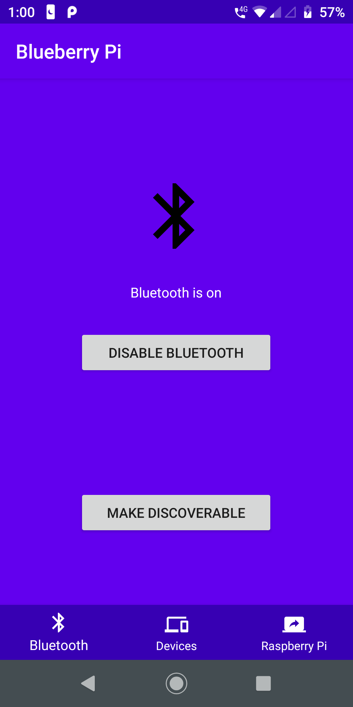
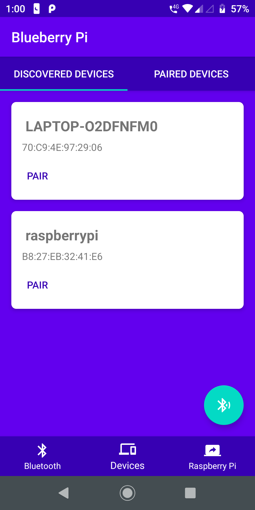
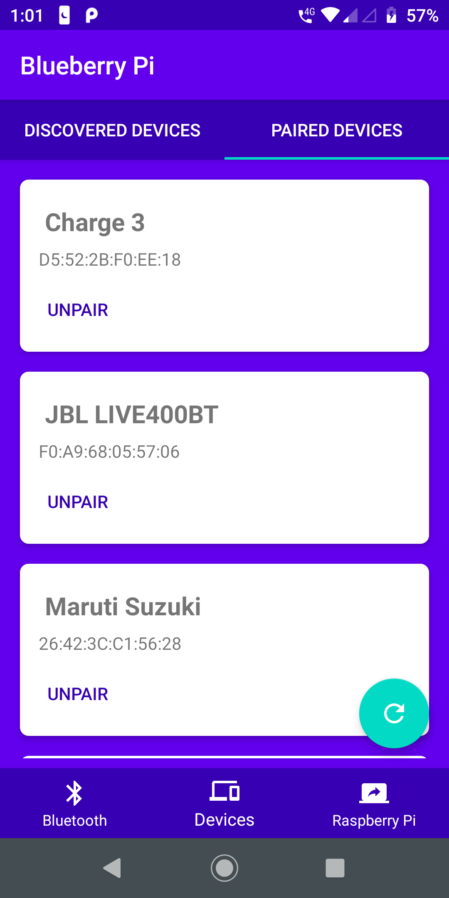
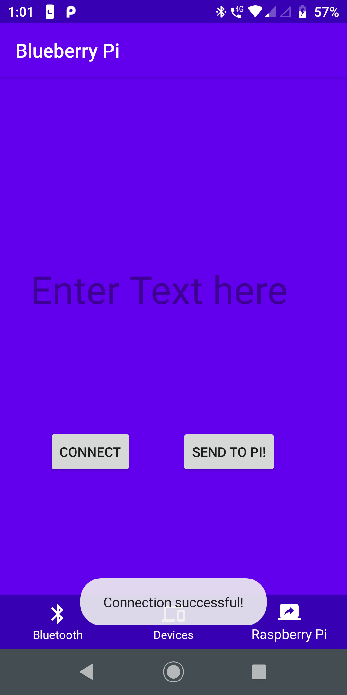
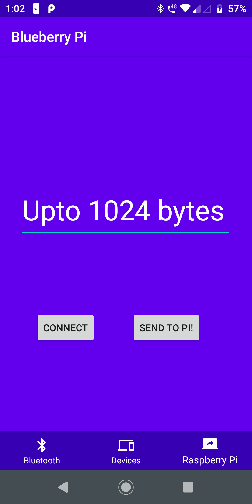
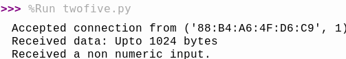

# Blueberry Pi

## Motivation

This project started as an exercise for a course at school, but after that was wrapped up due to
the pandemic, I still worked on it for a somewhat satisfactory product. The idea was to be able
to control some process on the Raspberry Pi using Bluetooth communication, which this application
is successfully able to do.

## Functionality

- Enable/Disable Bluetooth for current device
- Discover devices (that are not already bonded)
- Pair to new device
- List all bonded devices (i.e. devices whom have already paired), regardless of if they currently available
- Forget bonded devices
- Send a string to a paired Raspberry Pi (currently id is hard-coded). Amount and function depends on RPi end
- Wrapped in a neat custom UI created for a previous project which you can find
[here](https://github.com/ShreyansK2000/evnt-app)

## Screenshots

    
    

    
    

## Raspberry Pi Output

Sending a string after a successful connection will result in something like this:

    

    

## Acknowledgments

I got a lot of help from the course resources, several YouTube tutorials, and the BlueTerm application
APK. I'll be linking these resources here:

- [Coding with Mitch: Bluetooth in Android
Studio](https://www.youtube.com/watch?v=y8R2C86BIUc&list=PLgCYzUzKIBE8KHMzpp6JITZ2JxTgWqDH2)
- [Circuit Digest: Bluetooth on the Raspberry Pi
end](https://circuitdigest.com/microcontroller-projects/controlling-raspberry-pi-gpio-using-android-app-over-bluetooth)
(see description for tutorial as article)
- [BlueTerm repo](https://github.com/johnhowe/BlueTerm) (that I found) - specifically
`src/es/pymasde/blueterm/BluetoothSerialService.java`